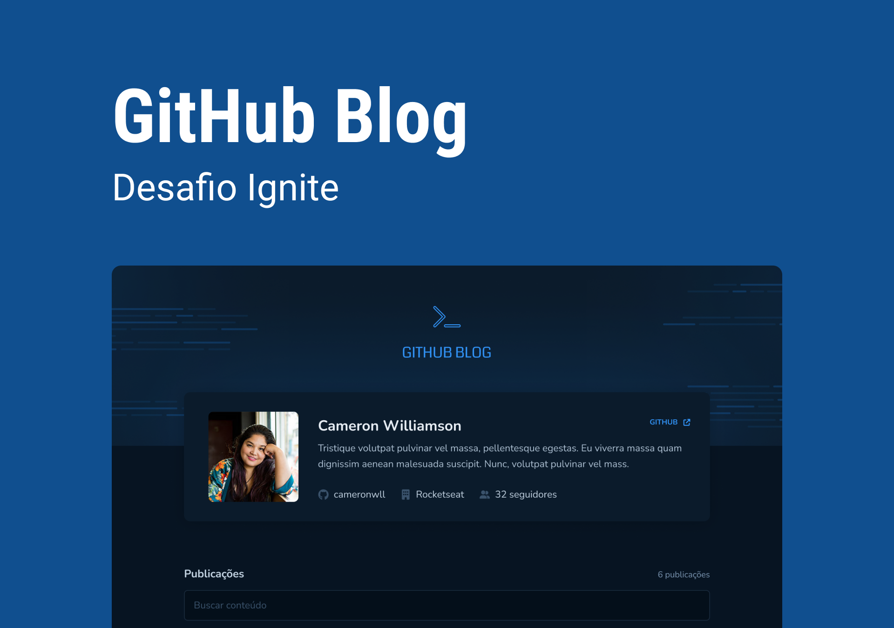

# Github-blog

## Desafio da trilha de React da rocketseat

<br />

## Capa

 <br/> <br/>

## Stack

- React
- React router dom
- Tailwind css
- Axios

## Aprendizados

- Utilizar React Markdown para transformar um texto markdown em html.
- Rotas dinâmicas com o React Router Dom.

## Design da aplicação

- Clique [aqui](https://www.figma.com/community/file/1138814951106121051) para acessar o layout no Figma

## Como executar a aplicação

### Instalação

1. Clone o repositório

```bash
git clone https://github.com/FixRuan/Github-Blog
```

2. Acesse a pasta do projeto

```bash
cd Github-Blog
```

3. Instale as dependências necessárias

```bash
yarn
```

4. Execute o projeto

```bash
yarn dev
```
